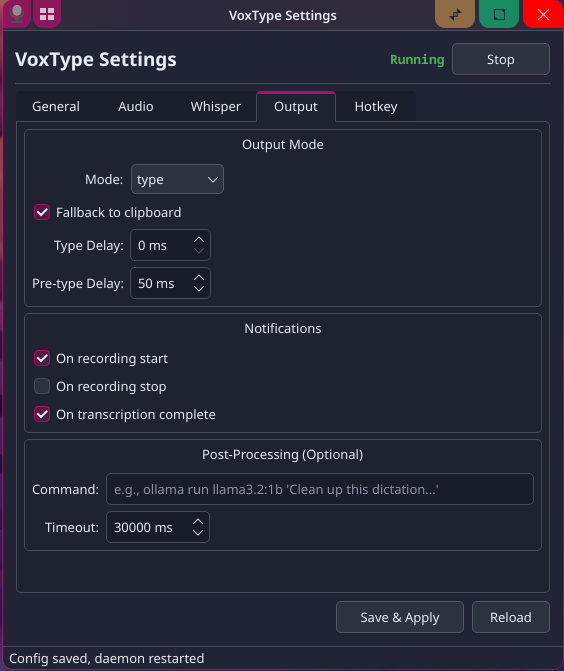
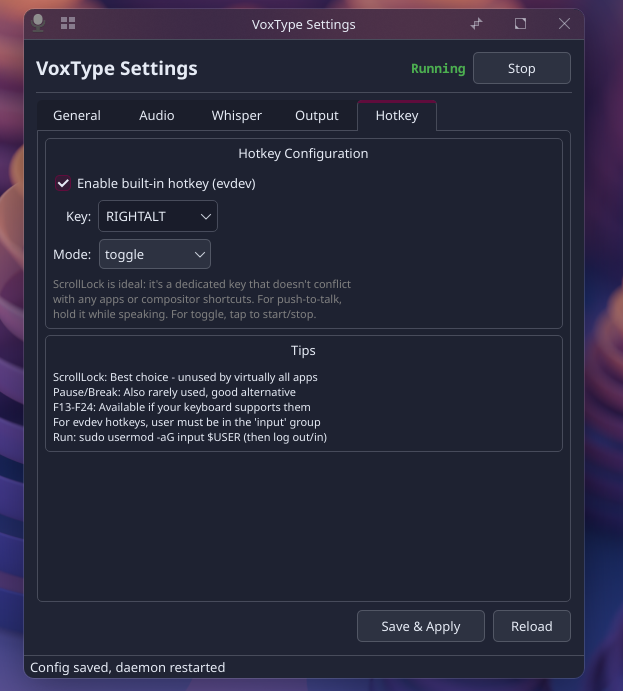

# VoxType Tray

A lightweight PyQt6 system tray application for [VoxType](https://github.com/peteonrails/voxtype) — the push-to-talk voice-to-text tool for Linux.

VoxType ships as a CLI daemon with a TOML config file. This app adds a proper GUI: a system tray icon with live status, quick controls, and a full settings editor.

  

<p align="center">
  &nbsp;&nbsp;
  
</p>

## Features

- **System tray icon** with color-coded state (green=idle, red=recording, amber=transcribing, gray=stopped)
- **Left-click** to toggle recording
- **Right-click menu** for daemon control (start/stop/restart), settings, and recording toggle
- **Full settings editor** with tabs for General, Audio, Engine, Output, and Hotkey configuration
- **Engine selector** for Whisper, Parakeet, and other VoxType 0.7+ engines
- **Parakeet text streaming** — toggle live cursor-anchored streaming (requires the `parakeet-unified-en-0.6b` model + VoxType 0.7.5+), tune chunk/context sizes
- **Model management** — download Whisper models directly from the GUI
- **Daemon control** — start, stop, and restart the systemd user service
- **Auto-saves and restarts** the daemon when settings change
- **Hides to tray** on window close — stays running in background

## Why This Exists

VoxType is excellent but configuration-only via a TOML file, with no GUI. On KDE Plasma Wayland specifically:

- `wtype` silently fails (KDE doesn't support the virtual-keyboard Wayland protocol) — you need `dotool` instead
- The evdev hotkey system requires `input` group membership, which isn't obvious
- There's no visual feedback for VoxType's state beyond terminal output

This tray app solves all of that with a native-feeling KDE experience.

## Requirements

- **VoxType** 0.7+ installed and configured (Parakeet streaming requires 0.7.5+)
- **Python** 3.11+
- **PyQt6** (`pacman -S python-pyqt6` on Arch)
- **dotool** (for KDE Plasma Wayland — `wtype` won't work)
- **wl-clipboard** (for clipboard fallback)

## Installation

### Arch Linux (AUR)

```bash
yay -S voxtype-tray
```

This installs the tray app, desktop entry, and autostart — it will launch automatically on your next login.

### KDE Plasma Wayland Setup

If you're on KDE Plasma with Wayland, you also need these:

```bash
# dotool for text input (wtype does NOT work on KDE Wayland)
yay -S dotool

# Clipboard support
sudo pacman -S wl-clipboard

# Input group for evdev hotkey access
sudo usermod -aG input $USER
# Log out and back in for group change to take effect
```

### Manual Install

```bash
# Copy the script
cp voxtype-tray.py ~/.local/bin/voxtype-tray
chmod +x ~/.local/bin/voxtype-tray

# Create desktop entry
cp voxtype-tray.desktop ~/.local/share/applications/

# Autostart on login
cp voxtype-tray.desktop ~/.config/autostart/
```

## Usage

```bash
# Launch (stays in tray)
voxtype-tray

# Or run directly
python3 voxtype-tray.py
```

- **Left-click** the tray icon to toggle recording
- **Right-click** for the full menu
- **Settings** opens the configuration editor
- **Save & Apply** writes the config and restarts the daemon automatically

## Configuration

The app reads and writes `~/.config/voxtype/config.toml`. All settings from VoxType's config are exposed in the GUI:

| Tab | Settings |
|-----|----------|
| **General** | Icon theme, spoken punctuation, word replacements, **backend selection (GPU / ONNX)**, model downloads (Whisper + Parakeet) |
| **Audio** | Input device, sample rate, max duration, feedback sounds |
| **Engine** | Engine selector (whisper/parakeet/moonshine/etc), per-engine settings, **Parakeet streaming** |
| **Output** | Output mode (type/clipboard/paste), delays, modifier-release guard, notifications, post-processing |
| **Hotkey** | Enable/disable, key selection, mode (toggle/push-to-talk) |

### Streaming text (Parakeet)

VoxType 0.7.5+ supports live cursor-anchored streaming via the Parakeet engine — text appears as you speak rather than after you stop. End-to-end from the tray (no terminal needed):

1. **General** tab → click **Enable ONNX (Parakeet, etc.)** (and **Enable GPU acceleration** if you have an AMD or NVIDIA GPU). Both require pkexec authentication once.
2. **General** tab → Models → pick **`parakeet-unified-en-0.6b`** → **Download Model**
3. **Engine** tab → set *Active engine* to `parakeet` and select `parakeet-unified-en-0.6b` as the model
4. Tick **Stream text live as you speak**
5. **Hotkey** tab → mode must be `toggle` (push-to-talk is incompatible)

> **Which model?** Streaming needs the purpose-built **`parakeet-unified-en-0.6b`** model. The general-purpose `parakeet-tdt-0.6b-v3` (and other TDT models) are excellent for normal batch dictation but **do not support streaming** — enabling streaming with one of those will fail at the daemon. VoxType 0.7.5+ auto-switches to the unified model when you turn streaming on; this tray surfaces the same requirement in its health checks.

The Backend group in General shows your current binary and recommends the right one for your detected GPU. Health checks at startup warn about engine/streaming/hotkey conflicts.

## GPU Acceleration

The easiest path is the **General** tab → **Enable GPU acceleration** button, which runs the right `voxtype setup gpu` command for your detected GPU and restarts the daemon. The notes below cover the per-vendor specifics and manual equivalents.

### NVIDIA GPUs

If you have an NVIDIA GPU with Vulkan support:

```bash
# Enable GPU acceleration
sudo voxtype setup gpu --enable

# Use small.en or medium.en for best speed/accuracy
# (configurable in the GUI under Whisper tab)
```

For laptops with hybrid graphics, enable "GPU memory isolation" in the Whisper tab to let the dGPU sleep between transcriptions.

### AMD GPUs (ROCm / MIGraphX)

AMD acceleration for the ONNX engines (Parakeet, etc.) runs through the **MIGraphX** execution provider. Once warmed up it's dramatically faster than CPU — on a typical setup, a few-second utterance transcribes in well under a second after the first run.

The fastest route is the GUI: **General** tab → **Enable ONNX (Parakeet, etc.)**, then **Enable GPU acceleration**. If anything is missing, the tray's health check flags it and offers a one-click **Fix MIGraphX library path** button. The manual equivalents:

```bash
# 1. The MIGraphX runtime library is a SEPARATE package from the ROCm stack.
#    rocm-hip-runtime alone is NOT enough — you need libmigraphx_c.so.3:
sudo pacman -S migraphx

# 2. Point the ONNX backend at the AMD GPU build:
sudo voxtype setup onnx --enable
sudo voxtype setup gpu --enable
```

A few AMD-specific gotchas worth knowing:

- **`/usr/bin/voxtype` must be a wrapper script, not a plain symlink.** ONNX Runtime locates its provider libraries relative to the binary's own directory, so a bare symlink makes the MIGraphX provider fail to load (it looks in `/usr/bin/` instead of the variant dir). VoxType 0.7.5+ installs a proper wrapper automatically; on older versions the tray's **Fix MIGraphX library path** button installs one for you. (See upstream [voxtype#443](https://github.com/peteonrails/voxtype/issues/443).)
- **A package upgrade can reset that symlink** back to a CPU build. If GPU dictation suddenly stops after an update, re-run **Enable GPU acceleration** (or the Fix button) to restore the wrapper.
- **MIGraphX needs a writable kernel-cache directory.** Without it, the first inference errors out trying to write its compiled kernels. Set it via a systemd user drop-in (`~/.config/systemd/user/voxtype.service.d/migraphx-cache.conf`):

  ```ini
  [Service]
  Environment="ORT_MIGRAPHX_CACHE_PATH=%h/.cache/migraphx"
  Environment="ORT_MIGRAPHX_MODEL_CACHE_PATH=%h/.cache/migraphx-models"
  Environment="HIP_VISIBLE_DEVICES=0"
  ```

  Then `systemctl --user daemon-reload && systemctl --user restart voxtype`. The first transcription after a model change will be slow while kernels compile and cache; subsequent runs are fast.

## License

MIT
